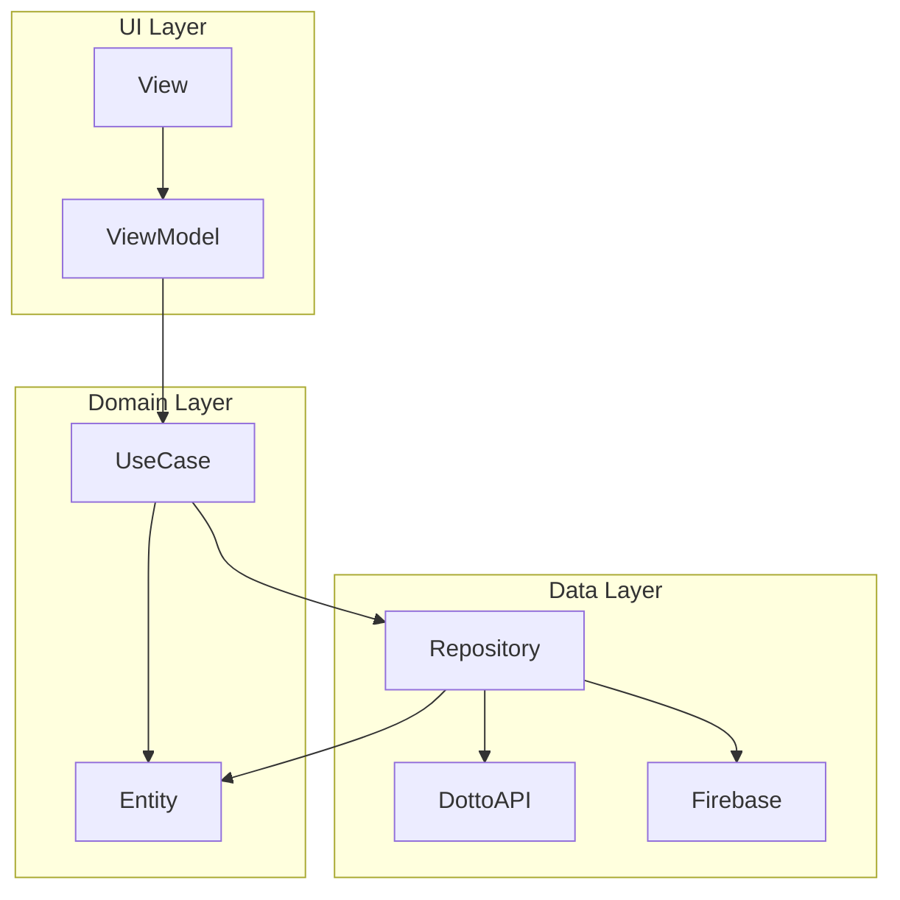

# Dotto アーキテクチャ

## Flutter 公式 アーキテクチャガイド

https://docs.flutter.dev/app-architecture/guide

Flutter 公式のアーキテクチャガイドを参考に、Dotto では以下のようなアーキテクチャを採用しています。

## MVVM + UseCase

### View

Dotto では、1 つの画面を 1 つの Screen とします。

Flutter の StatefulWidget により、Widget が状態を持つことが出来ますが、Dotto では原則、 ConsumerStatefulWidget を使用します。

Screen の状態は後述の ViewModel によって管理されます。

Screen は細かい Widget に分けることが出来ます。その場合でも、子 Widget は状態を持ってはいけません。

### ViewModel

1 つの Screen に対して、1 つの ViewModel が存在します。

ViewModel の役割は、Screen を構成するために必要な状態 (ViewState) を保持し、その操作を行います。

Flutter の Widget の仕組み上、ViewModel が Screen を操作することはなく、すべて ViewModel の状態が変化すると Widget が再描画されます。

### UseCase

ViewModel と Repository の橋渡しを行います。

### Repository

API レスポンスを Domain Entity に変換して返却します。

抽象化されたインターフェース (abstract class) として定義し、その実装に OpenAPI Generator により生成されたメソッドを呼び出す処理を書きます。

これにより、Repository のモックを作成し、UseCase および ViewModel のテストを行うことが出来ます。

## Riverpod

https://riverpod.dev/

Dotto では、ViewModel、Repository を Riverpod で管理します。

ViewModel を Provider で保持し、ConsumerWidget から watch することにより、ViewModel が保持している状態が変更されたことを検知することで、Widget が再描画されます。

また、Repository を Provider で保持しておくことで、テスト時にモックで上書きすることが出来ます。

## freezed

https://pub.dev/packages/freezed

ViewModel で保持する状態を構造体にまとめます。

Dart における構造体は class で表現されます。class は参照型であるため、freezed を使用することで、値型のように扱うためのメソッドを自動生成することが出来ます。

&copy; 2025 Dotto
